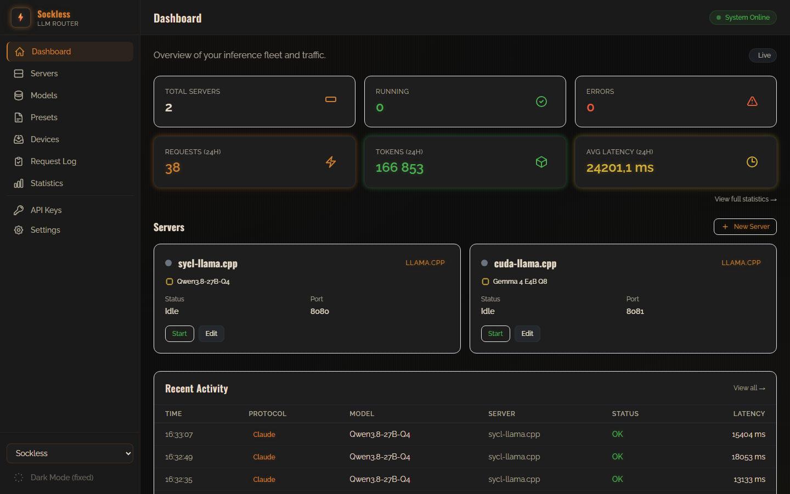
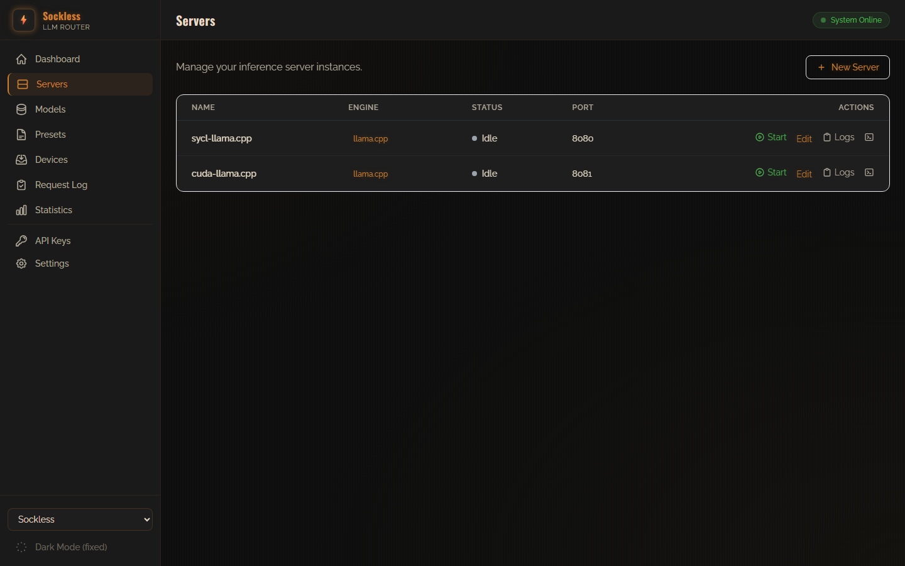
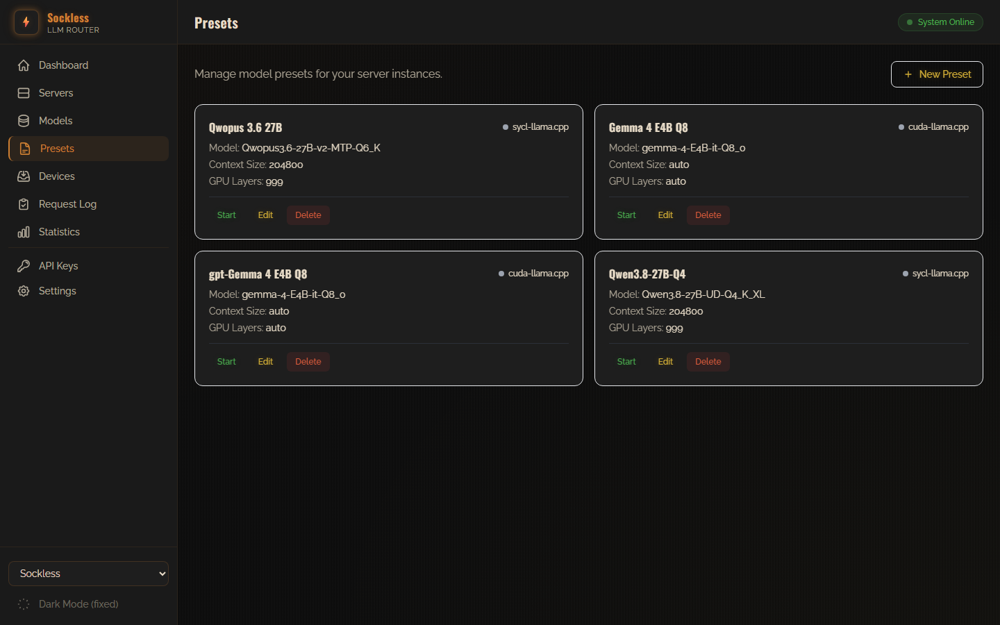
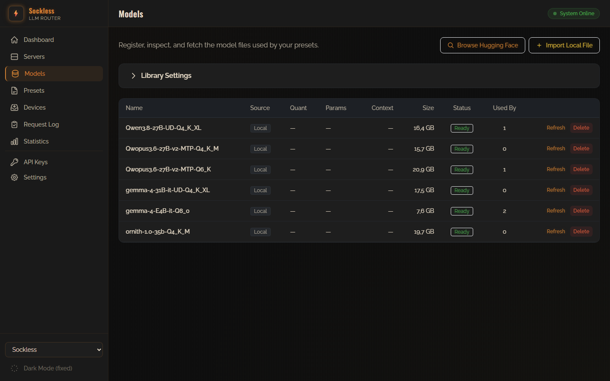
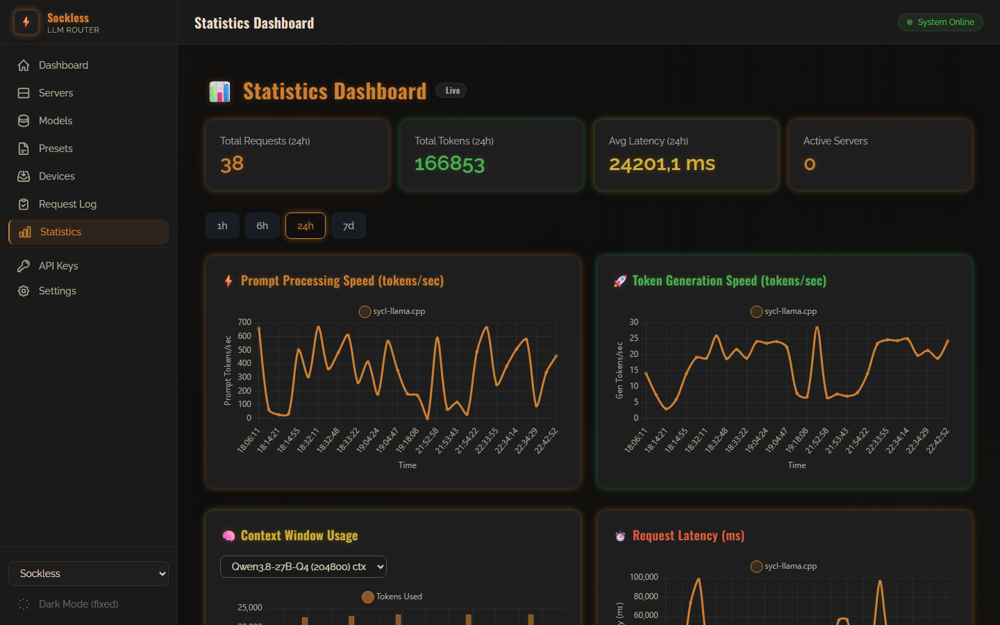
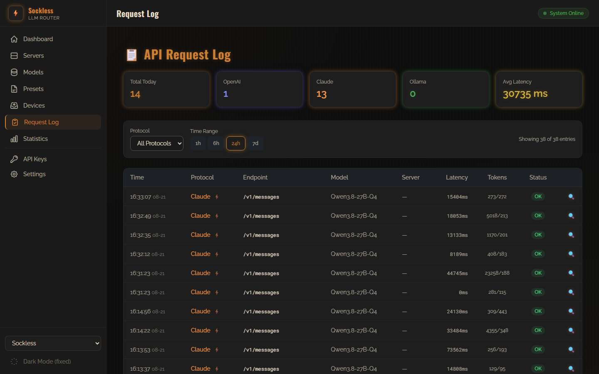
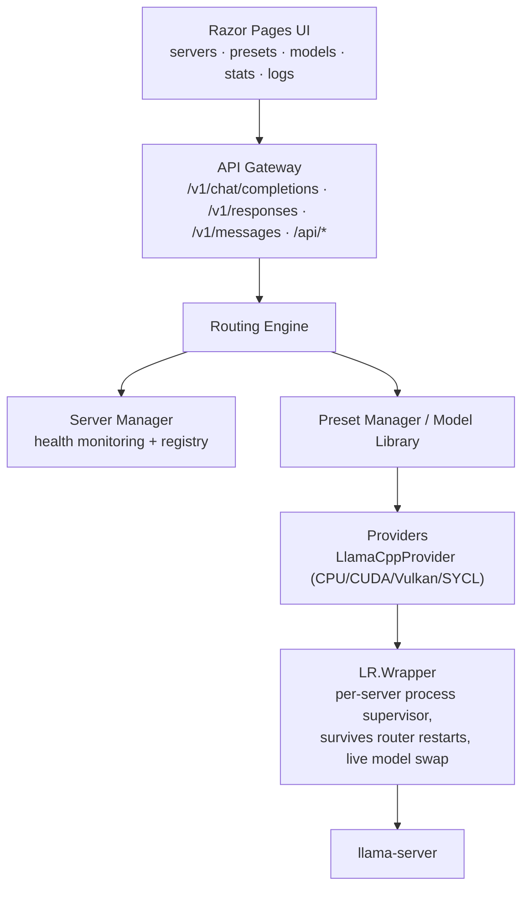

# LLM Router

A lightweight .NET-based routing layer for managing and load-balancing across multiple local LLM inference servers.

## Overview

LLM Router provides a unified interface to route requests across heterogeneous backend inference engines (CPU, CUDA, Vulkan, SYCL) running on different machines or GPUs. It features:

- **Multi-protocol API gateway** — Exposes OpenAI-compatible (`/v1/chat/completions`, `/v1/responses`, `/v1/models`), Claude-compatible (`/v1/messages`), and Ollama-compatible (`/api/chat`, `/api/generate`, `/api/tags`, ...) endpoints in front of your backend servers.
- **Tool / function calling** — Passes OpenAI-style `tools`/`tool_choice` through to llama.cpp backends and translates the resulting tool calls back into Chat Completions or Responses API shapes.
- **OpenAI Responses API** — Stateful `/v1/responses` support (create, retrieve, delete, cancel) built on top of the same Chat Completions plumbing, with stored conversation state.
- **Smart routing** — Priority-ordered routing rules, preset/model affinity (auto-start or restart the server that owns a preset), and round-robin fallback across healthy instances.
- **Health monitoring & auto-restart** — Background health checks detect failed or crashed backends and route around them.
- **Model library with Hugging Face integration** — A local registry of GGUF models with metadata inspection, folder scanning, and search/download directly from the Hugging Face Hub (with live progress).
- **Model presets** — Reusable llama.cpp launch configurations (sampling, context, GPU/threading, speculative decoding, LoRA, multimodal, etc.), optionally linked to a model-library entry so paths and metadata stay in sync.
- **Resilient backend supervision** — A separate wrapper process supervises each `llama-server` child process, so the router can restart without killing (or losing track of) running backends, and can live-swap models.
- **Request logging & stats dashboard** — Per-request API log with filtering, plus charts for throughput, latency, and context usage.
- **Razor Pages UI** — Web dashboard for managing servers, presets, the model library, request logs, and stats.

## Screenshots

| | |
|---|---|
| **Dashboard** — fleet overview, recent activity | **Servers** — instance registry, start/stop/edit |
|  |  |
| **Presets** — launch configurations per server | **Model Library** — GGUF registry with size/status |
|  |  |
| **Statistics** — throughput, latency, context usage | **Request Log** — per-request history with filtering |
|  |  |

## Architecture



### Projects

| Project | Description |
|---|---|
| **LR.Application** | ASP.NET Core web app — Razor Pages UI, API endpoint mappings (OpenAI/Claude/Ollama/Responses), SignalR hubs, background services, Windows Service hosting |
| **LR.Core** | Core interfaces, EF Core models/migrations (SQLite), and services — routing engine, server/preset/model-library managers, Hugging Face client, request logging, wrapper protocol |
| **LR.Providers** | Backend provider implementations (currently llama.cpp: arg building, process/wrapper management, response parsing) |
| **LR.Wrapper** | Standalone process that launches and supervises a `llama-server` child process over a named-pipe protocol, so a router restart doesn't kill the backend |

## API

| Protocol | Endpoints |
|---|---|
| OpenAI | `POST /v1/chat/completions` (streaming + non-streaming, tool calling), `GET /v1/models` |
| OpenAI Responses | `POST /v1/responses`, `GET /v1/responses/{id}`, `DELETE /v1/responses/{id}`, `POST /v1/responses/{id}/cancel` |
| Claude | `POST /v1/messages` |
| Ollama | `POST /api/chat`, `POST /api/generate`, `GET /api/tags`, `POST /api/show`, `POST /api/embed`, `GET /api/ps`, `GET /api/version` |
| Misc | `GET /health`; SignalR hubs `/serverHub` and `/modelDownloadHub` for live UI updates |

Protocols are toggled via `Gateway:EnabledProtocols` in configuration. Only `"function"`-type tools are supported for tool calling and the Responses API — OpenAI's built-in tools (web search, file search, code interpreter, computer use, image generation, MCP) and the Conversations API are not implemented.

## Getting Started

### Prerequisites

- .NET 10.0 SDK or later
- Node.js/npm (to build the Tailwind CSS bundle — see below)
- llama.cpp server binaries (`llama-server`/`llama-server.exe`) for whichever backend(s) you plan to run (CPU/CUDA/Vulkan/SYCL) — not bundled

### Building the frontend assets

```bash
cd LR.Application
npm install
npm run build:css
```

### Running the Application

#### Standalone (console)

```bash
dotnet run --project LR.Application
```

The application will start, apply any pending SQLite migrations (`data/lr.db`), and serve the Razor Pages dashboard. Add servers, presets, and model-library entries from the UI — there's no need to hand-edit configuration for routing data.

#### As a Windows Service

The same executable can run under the Service Control Manager — it detects how it was
launched and adapts automatically (no separate build or flag required).

1. Publish the app:

   ```powershell
   dotnet publish LR.Application -c Release -r win-x64 --self-contained false -o publish
   ```

2. Install the service (run PowerShell as Administrator):

   ```powershell
   .\install-service.ps1
   ```

   By default this creates a service named `LLMRouter` pointing at
   `LR.Application\bin\Release\net10.0\win-x64\publish\LR.Application.exe`. Pass
   `-PublishDir` if you published elsewhere.

3. Start it:

   ```powershell
   Start-Service LLMRouter
   ```

   Logs go to the Windows Event Log (source `LLM Router`, log `Application`) since
   there's no console attached when running as a service.

4. To remove it (run as Administrator):

   ```powershell
   .\uninstall-service.ps1
   ```

## Using the dashboard

- **Servers** — register backend server instances, point them at a llama.cpp build folder and GPU backend type, start/stop/restart them, and view live logs and status.
- **Presets** — define launch configurations (model path, context size, sampling parameters, GPU/threading, speculative decoding, LoRA, multimodal settings, etc.), optionally linked to a model-library entry so the model path and GGUF metadata stay in sync automatically.
- **Model Library** — import existing `.gguf` files, scan a folder for unregistered models, or search and download models from the Hugging Face Hub with live progress; inspect GGUF metadata per model.
- **Stats** — throughput, latency, and context-usage charts.
- **Request Log** — browse and filter logged API requests by protocol and time range.
- **Settings** — app-level configuration, including the model library's root folder and Hugging Face API token.

## Configuration

Edit `LR.Application/appsettings.json` for gateway-level settings (port, enabled protocols, request queueing/timeouts, request logging). Servers, presets, and the model library are managed through the dashboard and persisted to a local SQLite database (`data/lr.db`), not in `appsettings.json`.

## License

This project is licensed under the MIT License — see the [LICENSE](LICENSE) file for details.
