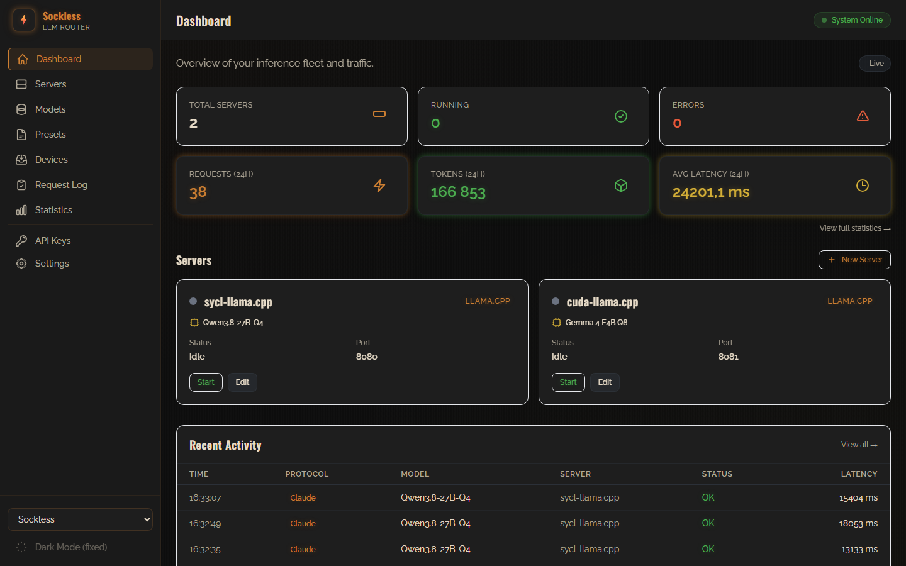
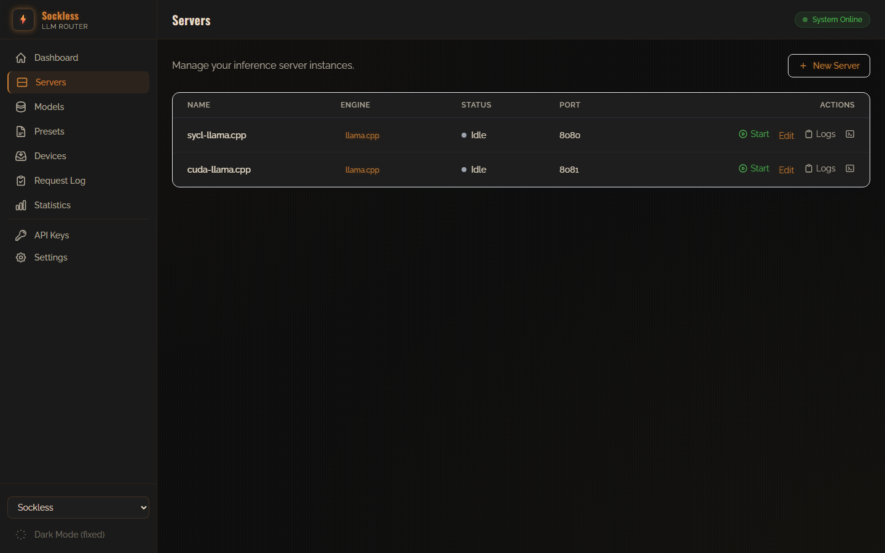
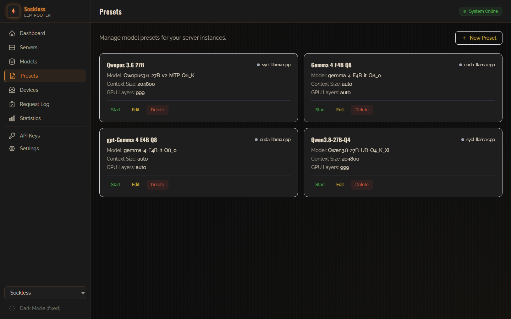
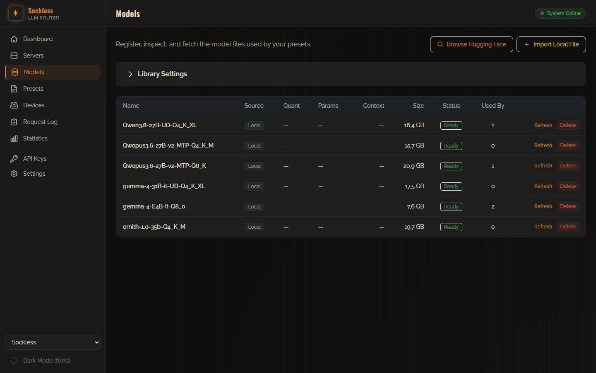
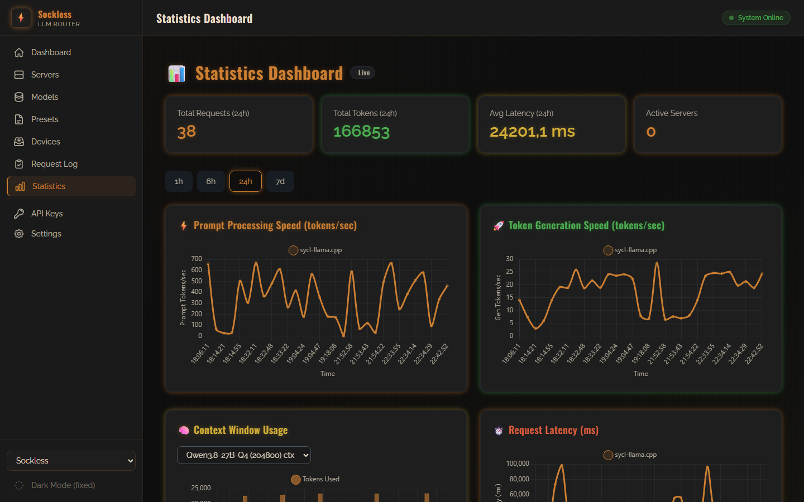
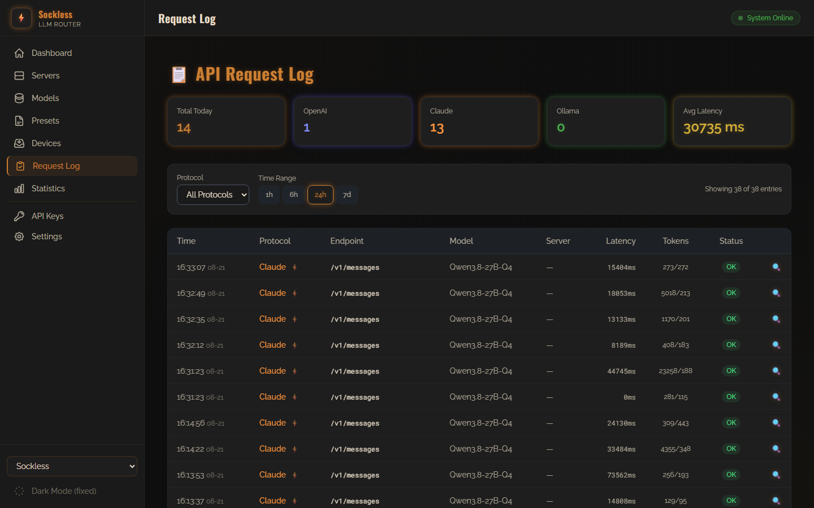
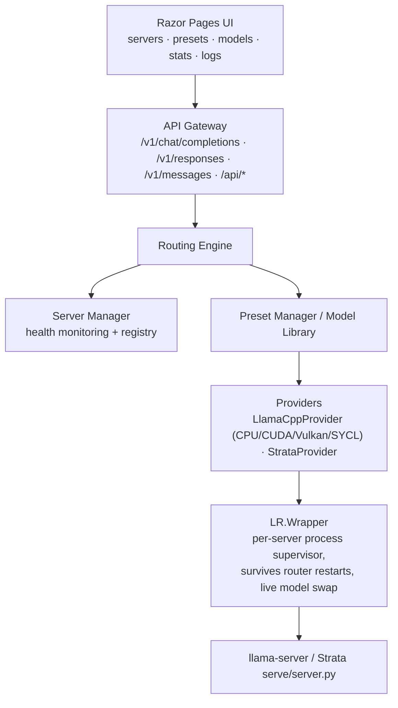

# LLM Router

A lightweight .NET-based routing layer for managing and load-balancing across multiple local LLM inference servers.

## Overview

LLM Router provides a unified interface to route requests across heterogeneous backend inference engines — [llama.cpp](https://github.com/ggml-org/llama.cpp) builds (CPU, CUDA, Vulkan, SYCL, ...) and [Strata](https://github.com/Niko1221/Strata) — running on different machines or GPUs. It features:

- **Multi-protocol API gateway** — Exposes OpenAI-compatible (`/v1/chat/completions`, `/v1/responses`, `/v1/models`), Claude-compatible (`/v1/messages`), and Ollama-compatible (`/api/chat`, `/api/generate`, `/api/tags`, ...) endpoints in front of your backend servers.
- **Tool / function calling** — Passes OpenAI-style `tools`/`tool_choice` through to llama.cpp backends and translates the resulting tool calls back into Chat Completions or Responses API shapes.
- **OpenAI Responses API** — Stateful `/v1/responses` support (create, retrieve, delete, cancel) built on top of the same Chat Completions plumbing, with stored conversation state.
- **Smart routing** — Priority-ordered routing rules, preset/model affinity (auto-start or restart the server that owns a preset), and round-robin fallback across healthy instances.
- **Health monitoring & auto-restart** — Background health checks detect failed or crashed backends and route around them.
- **Model library with Hugging Face integration** — A local registry of GGUF models with metadata inspection, folder scanning, and search/download directly from the Hugging Face Hub (with live progress).
- **Model presets** — Reusable llama.cpp launch configurations (sampling, context, GPU/threading, speculative decoding, LoRA, multimodal, etc.), optionally linked to a model-library entry so paths and metadata stay in sync.
- **Resilient backend supervision** — A separate wrapper process supervises each `llama-server` child process, so the router can restart without killing (or losing track of) running backends, and can live-swap models.
- **Request logging & stats dashboard** — Per-request API log with filtering, plus charts for throughput, latency, and context usage.
- **Razor Pages UI** — Web dashboard for managing servers, presets, the model library, request logs, and stats.

## Screenshots

| | |
|---|---|
| **Dashboard** — fleet overview, recent activity | **Servers** — instance registry, start/stop/edit |
|  |  |
| **Presets** — launch configurations per server | **Model Library** — GGUF registry with size/status |
|  |  |
| **Statistics** — throughput, latency, context usage | **Request Log** — per-request history with filtering |
|  |  |

## Architecture


```mermaid
flowchart TB
    UI["Razor Pages UI<br/>servers · presets · models · stats · logs"]
    Gateway["API Gateway<br/>/v1/chat/completions · /v1/responses · /v1/messages · /api/*"]
    Routing["Routing Engine"]
    ServerMgr["Server Manager<br/>health monitoring + registry"]
    PresetMgr["Preset Manager / Model Library"]
    Providers["Providers<br/>LlamaCppProvider (CPU/CUDA/Vulkan/SYCL) · StrataProvider"]
    Wrapper["LR.Wrapper<br/>per-server process supervisor,<br/>survives router restarts, live model swap"]
    Backend["llama-server / Strata serve/server.py"]

    UI --> Gateway
    Gateway --> Routing
    Routing --> ServerMgr
    Routing --> PresetMgr
    PresetMgr --> Providers
    Providers --> Wrapper
    Wrapper --> Backend
```

### Projects

| Project | Description |
|---|---|
| **LR.Application** | ASP.NET Core web app — Razor Pages UI, API endpoint mappings (OpenAI/Claude/Ollama/Responses), SignalR hubs, background services, Windows Service hosting |
| **LR.Core** | Core interfaces, EF Core models/migrations (SQLite), and services — routing engine, server/preset/model-library managers, Hugging Face client, request logging, wrapper protocol |
| **LR.Providers** | Backend engine providers: a shared base (`ManagedServerProviderBase` — wrapper process management, health, OpenAI/Anthropic request + SSE handling) with one folder per engine (`LlamaCpp/`, `Strata/`) |
| **LR.Wrapper** | Standalone process that launches and supervises a `llama-server` child process over a named-pipe protocol, so a router restart doesn't kill the backend |

## API

| Protocol | Endpoints |
|---|---|
| OpenAI | `POST /v1/chat/completions` (streaming + non-streaming, tool calling), `GET /v1/models` |
| OpenAI Responses | `POST /v1/responses`, `GET /v1/responses/{id}`, `DELETE /v1/responses/{id}`, `POST /v1/responses/{id}/cancel` |
| Claude | `POST /v1/messages` |
| Ollama | `POST /api/chat`, `POST /api/generate`, `GET /api/tags`, `POST /api/show`, `POST /api/embed`, `GET /api/ps`, `GET /api/version` |
| Misc | `GET /health`; SignalR hubs `/serverHub` and `/modelDownloadHub` for live UI updates |

Protocols are toggled via `Gateway:EnabledProtocols` in configuration. Only `"function"`-type tools are supported for tool calling and the Responses API — OpenAI's built-in tools (web search, file search, code interpreter, computer use, image generation, MCP) and the Conversations API are not implemented.

## Getting Started

### Prerequisites

- .NET 10.0 SDK or later
- Node.js/npm (to build the Tailwind CSS bundle — see below)
- For llama.cpp servers: `llama-server`/`llama-server.exe` binaries for whichever backend(s) you plan to run (CPU/CUDA/Vulkan/SYCL) — downloaded/compiled from the Engines page or your own builds
- For Strata servers: Git and Python 3.10+ (installed from the Engines page — see [Strata servers](#strata-servers))

### Building the frontend assets

```bash
cd LR.Application
npm install
npm run build:css
```

### Running the Application

#### Standalone (console)

```bash
dotnet run --project LR.Application
```

The application will start, apply any pending SQLite migrations (`data/lr.db`), and serve the Razor Pages dashboard. Add servers, presets, and model-library entries from the UI — there's no need to hand-edit configuration for routing data.

#### As a Windows Service

The same executable can run under the Service Control Manager — it detects how it was
launched and adapts automatically (no separate build or flag required).

1. Publish the app:

   ```powershell
   dotnet publish LR.Application -c Release -r win-x64 --self-contained false -o publish
   ```

2. Install the service (run PowerShell as Administrator):

   ```powershell
   .\install-service.ps1
   ```

   By default this creates a service named `LLMRouter` pointing at
   `LR.Application\bin\Release\net10.0\win-x64\publish\LR.Application.exe`. Pass
   `-PublishDir` if you published elsewhere.

3. Start it:

   ```powershell
   Start-Service LLMRouter
   ```

   Logs go to the Windows Event Log (source `LLM Router`, log `Application`) since
   there's no console attached when running as a service.

4. To remove it (run as Administrator):

   ```powershell
   .\uninstall-service.ps1
   ```

## Using the dashboard

- **Servers** — register backend server instances, pick their engine (llama.cpp or Strata), point them at a llama.cpp build / Strata folder, start/stop/restart them, and view live logs and status.
- **Presets** — define launch configurations (model path, context size, sampling parameters, GPU/threading, speculative decoding, LoRA, multimodal settings, etc.), optionally linked to a model-library entry so the model path and GGUF metadata stay in sync automatically.
- **Model Library** — import existing `.gguf` files, scan a folder for unregistered models, or search and download models from the Hugging Face Hub with live progress; inspect GGUF metadata per model.
- **Stats** — throughput, latency, and context-usage charts.
- **Request Log** — browse and filter logged API requests by protocol and time range.
- **Settings** — app-level configuration, including the model library's root folder and Hugging Face API token.

### Strata servers

[Strata](https://github.com/Niko1221/Strata) runs large Mixture-of-Experts models (Qwen3.8-Flash-Next) on consumer GPUs by offloading dormant experts to system RAM. It's set up the same way as llama.cpp:

1. **Engines → Strata → Install a release**: pick a release and its engine build — CUDA, CUDA 12 (older NVIDIA drivers) or AMD. The router clones that release into `<install root>/strata-<tag>-<engine>`, creates its `.venv` with Strata's pinned Python packages, and installs the engine, checked against the SHA-256 GitHub publishes for it. No model is installed. (Linux has no ready-made engines; Strata compiles one when a model is first prepared.)
2. **Models → Hugging Face**: download a Qwen3.8-Flash-Next GGUF, e.g. `ISTA-DASLab/Qwen3.8-Flash-Next-GSQ-RCO-GGUF` → `IQ3_XXS` (Swift 1.5, the Coder and Unsloth's quants work too). Split models are one entry: all shards are downloaded together.
3. **Servers**: create a server with engine **Strata**, bound to the install.
4. **Presets**: pick the model from the library and, in the **Strata** section, the context length, GPU, images, KV cache type, low-RAM mode and parallel requests (blank = Strata's recommendation for this PC). Start it.

The first start of a preset prepares its model for Strata with Strata's own `setup.py` in its existing-GGUF mode (`--gguf-dir`): it builds the model's pack, downloads the ~5 GB MTP draft layer once (shared by all models), and writes a run config tuned to this PC, which the router keeps per preset. Progress shows in the server's start status and log. This can take several minutes (longer in low-RAM mode, which writes the experts into one 35–77 GB file once); later starts skip it until the model, the preset's Strata settings or the install change. Prepared packs and the draft layer live in Strata's shared `Strata-data` folder next to the install. The server then runs as Strata's own `run-<model>` scripts would — `.venv` Python with `serve/server.py --engine strata --config <run config>` — on the router-assigned port, bound to `127.0.0.1`.

The Strata tab shows each install's version, commit, engine version and prepared models. It can check for updates (a release install against the latest release), update in place (a release install checks out the new tag and installs that release's same engine build; refused while a server is running from it), roll back the engine, or stop tracking an install (its files are never deleted). A Strata folder you set up yourself with `START-HERE.bat` can be added too; it updates like Strata's `UPDATE.bat`, and a preset can also point straight at one of its `strata-<model>.json` run configs.

If a run config (or `STRATA_API_KEY`) sets an API key, the router sends it automatically. Strata's `/props` and `/slots` mirror llama.cpp's, so slot-based concurrency limits, context-aware queuing, and the dashboard's slot/KV usage work the same as for llama.cpp servers.

### Adding another engine

1. Add a value to `ServerEngine` (append; values are persisted).
2. Implement an `IBackendProvider`. For an engine that runs as a local OpenAI-compatible HTTP server, derive from `ManagedServerProviderBase` and implement `BuildLaunchSpec` (what to launch) plus `IsModelLoadedLine`/`TryParseListeningPort` (how its output signals readiness); override the optional hooks for request headers, out-of-band metrics, or a longer startup timeout.
3. Implement an `IEngineDescriptor` (display name, provider type, install-folder help and validation, what a preset's model path means) and register it in `ServiceCollectionExtensions.AddBackendEngines`.
4. Optionally, version management on the Engines page: an `IEngineInstallHandler` (upstream repo, how to tell a ready install from a missing one, what to compare updates against), the install/update jobs in an `EngineBuildService` partial (see `EngineBuildService.Strata.cs`), and a tab partial `Pages/Features/Engines/Tabs/_<Engine>.cshtml`. Installs are rows in `EngineBuilds` with their `Engine` set, so servers bind to them the same way for every engine.

The server pages, Engines tabs, provider factory, routing, and dashboards pick the new engine up from the catalog. Implementing `IServerCapacityProvider` (which the base class does) opts it into slot-based concurrency gating.

## Configuration

Edit `LR.Application/appsettings.json` for gateway-level settings (port, enabled protocols, request queueing/timeouts, request logging). Servers, presets, and the model library are managed through the dashboard and persisted to a local SQLite database (`data/lr.db`), not in `appsettings.json`.

## License

This project is licensed under the MIT License — see the [LICENSE](LICENSE) file for details.
